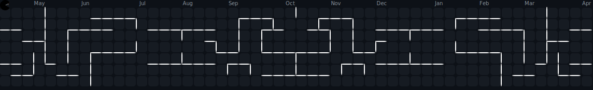

[)](https://git.io/typing-svg)

# About Me:

- 👨‍💻 &nbsp; Front-End Developer
- 🎓 &nbsp; Student of IT subject in university
- 🎯 &nbsp; Learning Git & Github 	

 

# 💻 Tech Stack:

### Icon 1

 

### Icon 2

### Icon 3

  
  
  
  
  
  
  
  
  

### Icon 4

## 🌐 Socials:

### Icon 1

 

# 📊 GitHub Stats:

### Type 1

  
  

### Type 2

### Type 3

 

